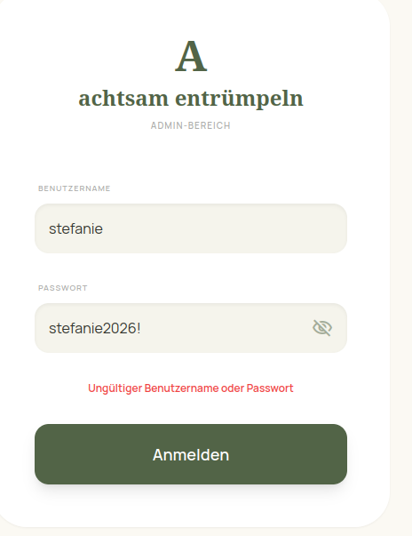
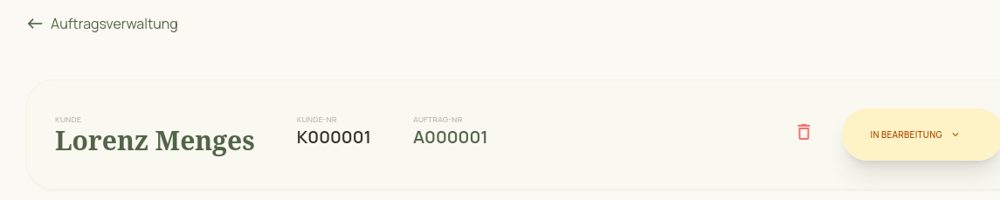

# 📖 Bedienungsanleitung: Achtsam Entrümpeln (Admin-Bereich)

Willkommen im Admin-Bereich von **Achtsam Entrümpeln**! Diese Software wurde speziell dafür entwickelt, deine Kunden, Aufträge und Dokumente sicher, zentral und übersichtlich zu verwalten. 

---

## 1. Login & Zugang

Das System ist über deine persönliche Cloud-URL erreichbar und komplett passwortgeschützt, sodass keine unbefugten Personen Zugriff auf sensible Kundendaten haben.

1. Öffne den Link zur Software in deinem Browser (z.B. Safari, Chrome).
2. Gib deinen **Benutzernamen** (z.B. `stefanie` oder `admin`) ein.
3. Trage dein **Passwort** ein. 
   > **TIPP:** Klicke auf das **Augen-Symbol** im Passwortfeld, um dein Passwort zur Kontrolle im Klartext anzeigen zu lassen.
4. Klicke auf **Anmelden**.

---

## 2. Das Dashboard & Auftragsverwaltung

Nach dem Login landest du direkt im Herzstück der Software: Der **Auftragsverwaltung**. Hier siehst du alle laufenden Projekte.

### Einen neuen Auftrag erstellen
Um ein neues Entrümpelungs-Projekt anzulegen, klickst du auf den Button **"Neuer Auftrag"**.
Du wählst dann einfach einen bestehenden Kunden aus der Liste aus und bestimmst, ob der Auftrag sich im Status *Anfrage*, *In Bearbeitung* oder *Abgeschlossen* befindet.

### Die Detailansicht eines Auftrags
Klickst du auf einen Auftrag, öffnet sich die Detailansicht. 

Im oberen Bereich (Header) siehst du sofort alle wichtigen Kennzahlen auf einen Blick:
- **Kunde:** Der Name des Auftraggebers
- **Kunde-Nr & Auftrag-Nr:** Automatisch generierte, fortlaufende Nummern (z.B. A000001)
- **Erstellt von:** Der Name der Person, die diesen Auftrag im System angelegt hat (z.B. Stefanie). *(Bei ganz alten Aufträgen steht hier "Unbekannt", bei allen neuen der echte Name).*

---

## 3. Dokumente (Vertrag & Datenschutz)

Du musst Verträge und Datenschutzerklärungen nie wieder mühsam in Word abtippen. Das System macht das auf Knopfdruck für dich!

1. Öffne die **Detailansicht** eines Auftrags.
2. Wechsle in den Reiter **"Dokumente"**.
3. Klicke auf **Dokument generieren** und wähle aus, ob du einen *Vertrag* oder eine *Datenschutzerklärung* brauchst.
4. Das System erstellt in Sekunden ein wunderschönes, fertiges PDF. 
   - Die Kundendaten (Name, Adresse) und die Auftragsnummer werden völlig automatisch in den Briefkopf eingesetzt.
   - Du kannst das PDF dann direkt herunterladen und an den Kunden schicken.

> **HINWEIS:** Das Design der Dokumente ist extrem clean gehalten. Statt klobiger Boxen nutzt das System einen sehr eleganten, kompakten Header.

---

## 4. Zeiterfassung & Einsätze

Du warst bei einem Kunden und hast entrümpelt? 
In der Detailansicht des Auftrags unter **"Einsätze"** kannst du deine Zeiten und gefahrenen Kilometer eintragen.
Das System summiert diese Zeiten vollautomatisch zusammen, was dir (in Zukunft) dabei hilft, fehlerfreie Rechnungen auf Knopfdruck zu erstellen!

---

## 5. Kundenverwaltung

Wenn du im Menü (links) auf **Kunden** klickst, landest du im Kunden-Adressbuch.
Hier kannst du:
- Neue Kunden anlegen (Vorname, Nachname, Adresse, E-Mail).
- Alte Kunden archivieren oder bearbeiten.
- Nach Kunden suchen.

> **TIPP:** Du hast einen Kunden am Telefon, der vor 2 Jahren schon einmal da war? Die Suchleiste findet ihn in Sekunden, und du kannst aus seinem alten Profil heraus direkt einen komplett neuen Auftrag anlegen!

---
*Ende des Handbuchs*
